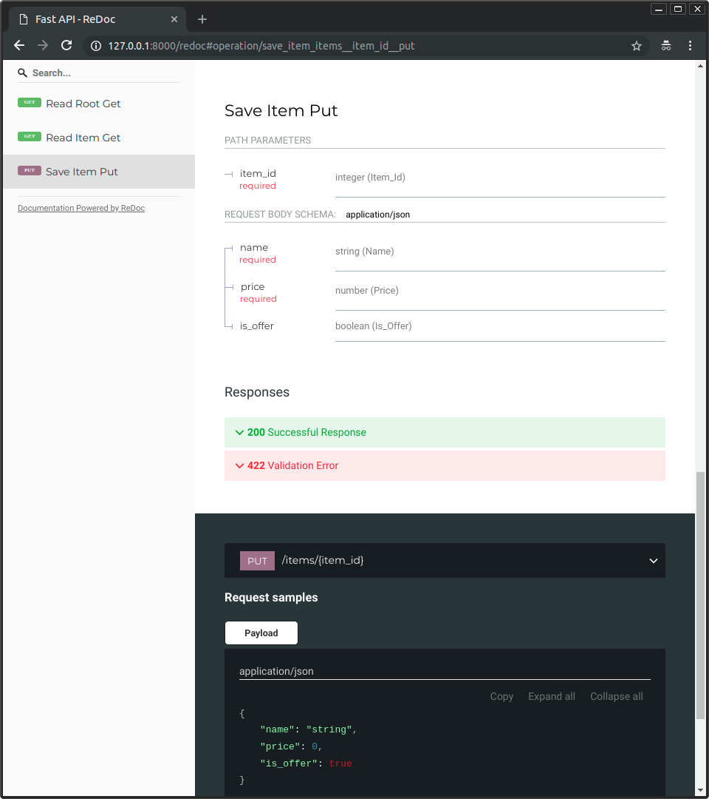
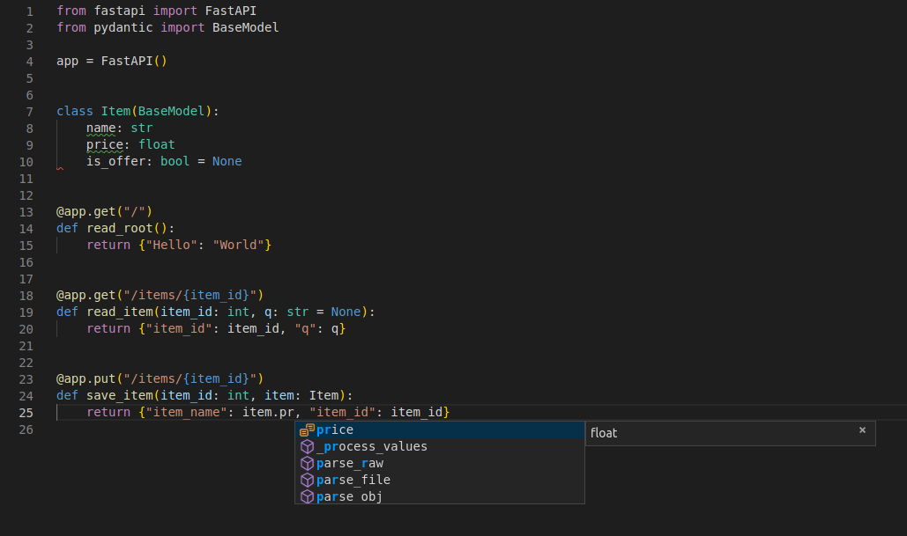
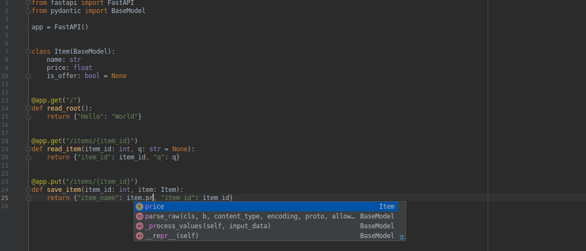

## FastAPI功能

**FastAPI** 为你提供以下内容：

### 基于开放标准

* 用于API创建的<a href="https://github.com/OAI/OpenAPI-Specification" class="external-link" target="_blank"><strong>OpenAPI</strong></a>，包括路径（也称为：端点，路由）操作（也称为HTTP请求方法，像是POST，GET，PUT，DELETE）的声明，参数，主体请求，安全性等。
* 带有<a href="http://json-schema.org/" class="external-link" target="_blank"><strong>JSON Schema</strong></a>的自动数据模型文档。（因为OpenAPI本身基于JSON Schema）。
* 经过仔细研究，围绕这些标准进行了设计。Instead of an afterthought layer on top.
* 这也允许使用多种语言的自动**客户端代码生成**。

### 自动文档

交互式API文档和探索式Web用户界面。 由于该框架基于OpenAPI，因此有多个选项，默认情况下包含2个。

* <a href="https://github.com/swagger-api/swagger-ui" class="external-link" target="_blank"><strong>Swagger UI</strong></a>，具有交互式探索功能，可直接从浏览器直接调用和测试您的API。


* 基于<a href="https://github.com/Rebilly/ReDoc" class="external-link" target="_blank"><strong>ReDoc</strong></a>的替代API文档。



### 仅是现代Python

所有这些都基于标准的**Python 3.6 类型**声明（感谢Pydantic）。没有新的语法需要学习。只是标准的现代Python。

如果你需要2分钟的时间来重新了解如何使用Python类型（即使你不使用FastAPI），请查看简短的教程：[Python类型](python-types.md)

你使用以下类型编写标准的Python：

```Python
from typing import List, Dict
from datetime import date

from pydantic import BaseModel

# Declare a variable as a str
# and get editor support inside the function
def main(user_id: str):
    return user_id


# A Pydantic model
class User(BaseModel):
    id: int
    name: str
    joined: date
```

然后可以这样使用：

```Python
my_user: User = User(id=3, name="John Doe", joined="2018-07-19")

second_user_data = {
    "id": 4,
    "name": "Mary",
    "joined": "2018-11-30",
}

my_second_user: User = User(**second_user_data)
```

> 信息
> `**second_user_data`意思是：
> 直接将字典`second_user_data`的键和值作为键值参数传递，等效于：`User(id=4, name="Mary", joined="2018-11-30")`

### 编辑器支持

所有框架的设计都易于使用和直观，所有决定甚至在开始开发之前就已经在多个编辑器上进行了测试，以确保最佳的开发体验。

在上一次Python开发人员调查中，很明显<a href="https://www.jetbrains.com/research/python-developers-survey-2017/#tools-and-features" class="external-link" target="_blank">最常用的功能是“自动补全” </a>。

整个**FastAPI**框架就是为了满足这一要求。自动补全功能无处不在。

你将很少需要返回文档。

你的编辑器可以为你提供以下帮助：

* 在<a href="https://code.visualstudio.com/" class="external-link" target="_blank">Visual Studio Code</a>里:



* 在<a href="https://www.jetbrains.com/pycharm/" class="external-link" target="_blank">PyCharm</a>里:



你将获得以前甚至可能认为不可能完成的代码。例如，来自请求的JSON主体（可能是嵌套的）中的`price`键。

无需再键入错误的键名，在文档之间来回或上下滚动来查找你是否最终使用了`username`或`user_name`。

### 简洁

它对所有内容都具有合理的**默认值**，随处可见可选配置。可以对所有参数进行微调，以执行所需的操作并定义所需的API。

但默认情况下，所有这些**都行得通**。

### 验证方式

* 验证大多数（或所有？）Python **数据类型**，包括：
    * JSON 对象（`dict`）。
    * 定义项目类型的JSON数组（`list`）。
    * 字符串（`str`）字段，用于定义最小和最大长度。
    * 带有最小值和最大值的数字（`int`，`float`）等。

* 验证更多特殊类型，例如：
    * URL
    * Email
    * UUID
    * ...和其他。

所有验证均由完善可靠的**Pydantic**处理。

### 安全与认证

集成了安全性和身份验证。无需对数据库或数据模型进行任何妥协（compromise with）。

OpenAPI中定义的所有安全方案，包括：

* HTTP基础。
* **OAuth2**（还带有**JWT令牌**）。查看[带JWT的OAuth2](tutorial/security/oauth2-jwt.md)上的教程。
* API密钥：
    * 标头。
    * 查询参数。
    * Cookies等。

加上Starlette的所有安全功能（包括**会话cookie**）。

所有这些都是可重用的工具和组件，可轻松与您的系统，数据存储，关系数据库和NoSQL数据库等集成。

### 依赖注入

FastAPI包括一个非常易于使用但功能非常强大的**依赖注入（也称为“组件”，“资源”，“服务”，“提供者”）**系统。

* 甚至依赖项也可以具有依赖项，从而创建层次结构或**依赖关系图**。
* 所有由框架**自动处理**。
* 所有依赖项都可能需要来自请求的数据，**增强路径操作**约束和自动文档。
* 即使在依赖项中定义的*路径操作*参数，也可以**自动验证**。
* 支持复杂的用户身份验证系统，**数据库连接**等
* 与数据库，前端等**没有任何妥协(No compromise)**。但易于与所有数据库集成。

### 无限的“插件”

或者以其他方式，不需要它们，导入并使用所需的代码。

任何集成的设计都非常易于使用（具有依赖项），以至于你可以用两行代码为应用程序创建一个“插件”，使用与*路径操作*相同的结构和语法。

### 经过测试

* 100% 测试覆盖率（自动测试的代码量）。
* 100% 键入带注释（Python类型注释，借助此注释，你的编辑器和外部工具可以为你提供更好的支持）的代码库。
* 用于生产应用。

## Starlette功能

**FastAPI**与<a href="https://www.starlette.io/" class="external-link" target="_blank"><strong>Starlette</strong></a>完全兼容（并基于此）。因此，你拥有的任何额外的Starlette代码也将起作用。

FastAPI实际上是`Starlette`的子类。因此，如果你已经了解或使用Starlette，则大多数功能将以相同的方式工作。

使用**FastAPI**，你可以获得**Starlette**的所有功能（因为FastAPI只是类固醇上的Starlette(as FastAPI is just Starlette on steroids)）：

* 令人印象深刻的性能。它是<a href="https://github.com/encode/starlette#performance" class="external-link" target="_blank">最快的Python框架之一，与**NodeJS**和**Go**相当。</a>。
* **WebSocket**支持。
* **GraphQL**支持。
* 后台任务处理。
* 启动和关闭事件。
* 测试基于`requests`的客户端。
* **CORS**，GZip，静态文件，流式响应。
* **会话和Cookie**支持。
* 100% 测试覆盖率。
* 100% 键入带注释的代码库。

## Pydantic功能

**FastAPI**与<a href="https://pydantic-docs.helpmanual.io" class="external-link" target="_blank"><strong>Pydantic</strong></a>完全兼容（并基于此）。 因此，你拥有的任何额外的Pydantic代码也将起作用。

包括也基于Pydantic的外部库，例如用于数据库的**ORM（对象关系映射器）**，**ODM（对象文档映射器）**。

这也意味着在许多情况下，你可以将从请求中获得的同一对象**直接传递给数据库**，因为所有内容都是自动验证的。

在其他情况下也是如此，在许多情况下，你只需将从数据库中获取的对象**直接传递给客户端**即可。

使用**FastAPI**，你可以获得**Pydantic**的所有功能（因为FastAPI基于Pydantic进行所有数据处理）：

* **傻瓜式**:
    * 无需学习新的架构定义微语言。
    * 如果你知道Python类型，就会知道如何使用Pydantic。
* 与你的**IDE（集成开发环境，类似于代码编辑器）/linter（一个检查代码错误的程序）/脑袋**一起好好玩耍：
    * 因为pydantic数据结构只是你定义的类的实例；自动补全，整理，mypy和你的直觉都应与验证的数据一起正常工作。
* **快速**:
    * 在<a href="https://pydantic-docs.helpmanual.io/#benchmarks-tag" class="external-link" target="_blank">基准测试</a>中，Pydantic比所有其他经过测试的库更快。
* 验证**复杂结构**：
    * 使用分层的Pydantic模型，Python的`类型`的`List`和`Dict`等。
    * 验证器允许将复杂的数据模式清晰，轻松地定义，检查并记录为JSON Schema。
    * 你可以拥有深度**嵌套的JSON**对象，并使它们全部经过验证和注释。
* **可扩展的**：
    * Pydantic允许定义自定义数据类型，或者你可以使用由验证器装饰器装饰的模型上的方法扩展验证。
* 100% 测试覆盖率。
